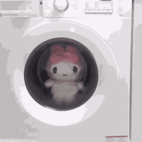

<!-- ## 👋 &nbsp;hi im xuo -->

### 👨🏻‍💻 &nbsp;About Me
💡 &nbsp;hey, lynn here.\
🌱 &nbsp;why didn't the programmer get a raise? he didn't get arrays!\
🍟 &nbsp;i like to eat in my free time\
✉️ &nbsp;message me and i'll respond instantly!.

### 🛠 &nbsp;Tech Stack

&nbsp;
&nbsp;
&nbsp;
&nbsp;
&nbsp;
&nbsp;
&nbsp;
&nbsp;

### ⚙️ &nbsp;Cool Analytics

<h3 align="center">
🤝🏻 &nbsp;Connect with Me
</h3>

<!---->

